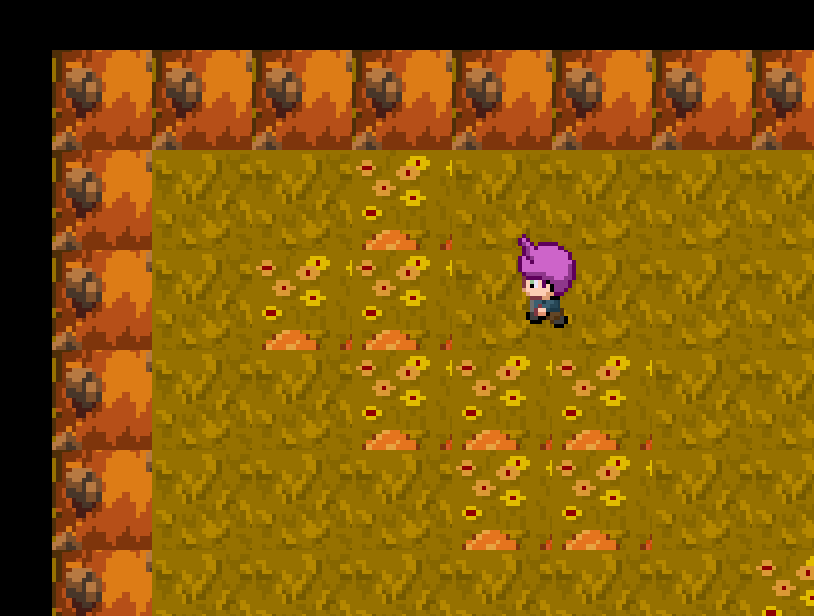

# Farming game [title TBD]

## Concept

Stardew Valley + selling mechanic from Recettear
Limited number of people to buy + sell from: affects disposition
Have to set up your stall with goods that you farmed yourself

## Goals

Performant on MacBook Air

Casual, pleasant atmosphere

## Screenshot

## TODO

* Tools and tool menu
* Ability to clear rocks and grass
* Ability to plant seeds. Daytime/night-time system
* Crop maturity and picking
* Selling and negotiation minigame [very much tbd]
